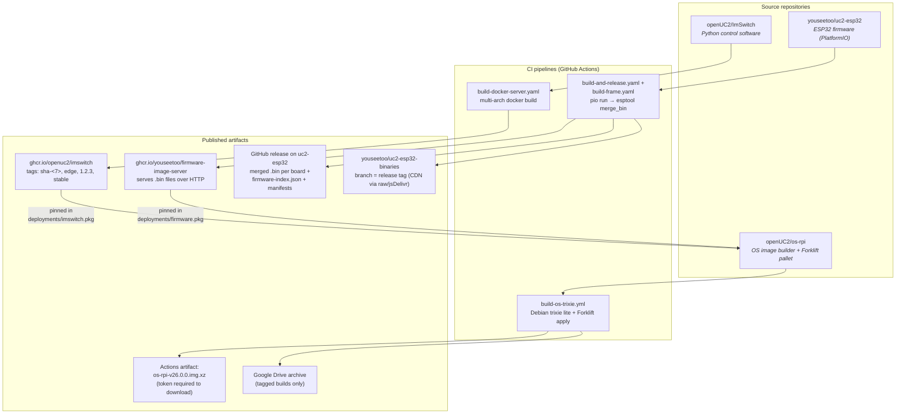
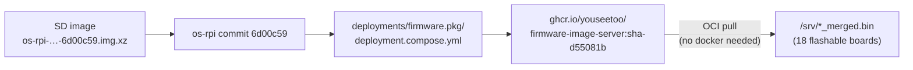
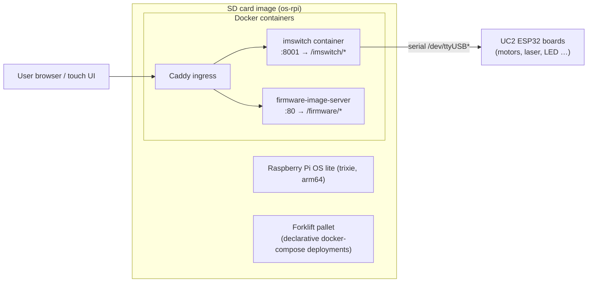
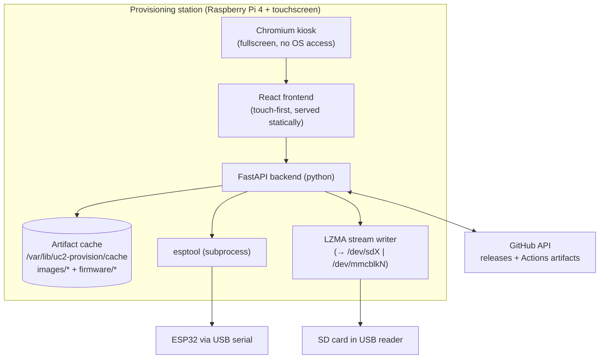
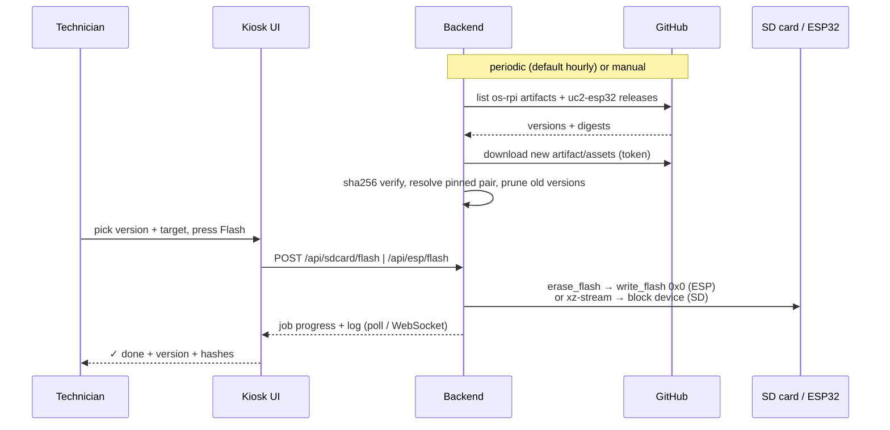
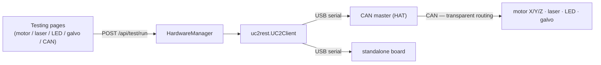

# Architecture & artifact provenance

This document answers two questions:

1. **Where does every byte we flash come from?** (source → CI → artifact → station)
2. **How is the provisioning station itself built?**

## 1. The big picture — who builds what

Two independent source trees produce everything an openUC2 microscope runs.
The **os-rpi** repo is the integration point: it *pins* specific builds of
both and bakes them into one SD card image.



### The "matching pair" — how the station guarantees it

Every os-rpi commit pins exact container references in its compose files:

| File in os-rpi | Pins | Example |
|---|---|---|
| `deployments/imswitch.pkg/deployment.compose.yml` | ImSwitch server | `ghcr.io/openuc2/imswitch:sha-50eee42` |
| `deployments/firmware.pkg/deployment.compose.yml` | Firmware server | `ghcr.io/youseetoo/firmware-image-server:sha-d55081b` |

For any image — identified by the commit sha embedded in its artifact name,
e.g. `os-rpi-pr-285-`**`6d00c59`**`.img.xz` — the station does a **reverse
lookup**: it reads those two compose files at that commit and learns exactly
which ImSwitch build and which firmware server are baked into the image.

The crucial part: **the firmware-image-server container *is* the firmware
bundle.** It ships the matching `.bin` files under `/srv` and serves them to
the microscope over HTTP. So instead of guessing which uc2-esp32 release
corresponds to an image (the pin is often a `sha-…` tag with no release at
all), the station pulls that exact container from GHCR and extracts its
binaries:



This is the same "forklift" idea the Pi itself uses, applied at provisioning
time. Selecting an image in the UI therefore *locks* the ESP32 page to the
firmware bundle that belongs with it; an explicit "Any firmware" switch is
required to break the pairing.

Two other firmware sources exist for boards that are not part of an SD
image: **uc2-esp32 GitHub releases** (friendly-named merged binaries), and
the **ODMR** boards, whose full 4 MB images live in `youseetoo.github.io`
under `static/firmware_build/odmr-xiao-esp32{s3,c3}.bin`.

> **Merged vs app-only:** both the container and the releases ship
> `esp32_<env>.bin` (app only, belongs at `0x10000`) *and*
> `esp32_<env>_merged.bin` (bootloader + partitions + app, belongs at `0x0`).
> The board catalog only ever selects merged images — writing an app-only
> binary at offset 0 produces a board that never boots.

## 2. What runs on the microscope's Raspberry Pi



## 3. ESP32 firmware build detail

`build-and-release.yaml` in uc2-esp32 builds each PlatformIO environment and
merges bootloader + partition table + boot_app0 + app into **one binary**:

```
esptool merge_bin --flash_mode dio --flash_freq 40m --flash_size 4MB
    0x1000 bootloader.bin      (0x0 on ESP32-S3/C3)
    0x8000 partitions.bin
    0xe000 boot_app0.bin
    0x10000 firmware.bin
→ <board_id>.bin               (flash the whole thing at offset 0x0)
```

Board catalog (from `firmware-index.json`, shipped with every release):

| board id | chip | role |
|---|---|---|
| `esp32-uc2-standalone-2/-3/-4` | ESP32 | all-in-one controller (UC2 v2/v3/v4) |
| `esp32-uc2-wemos` | ESP32 | Wemos-based standalone |
| `uc2-can-master` | ESP32 | CAN bus master (HAT) |
| `uc2-can-slave-motor` (+ `_motX/Y/Z/A` per-axis builds) | ESP32-S3 | motor driver module |
| `uc2-can-slave-laser` / `-led` / `-galvo` / `-gpio` / `-accelmotor` | ESP32-S3 | function modules |
| `uc2-can-standalone-v4` | ESP32 | CAN standalone v4 |
| `uc2-can-bridge-ps4-usbhost` | ESP32-S3 | PS4 controller bridge |
| `seeed_xiao_esp32s3*` | ESP32-S3 | Xiao-based boards |

Because the binaries are merged images, the station's flash procedure is
simply:

```
esptool erase_flash                       # 115200 baud, wipes old config/NVS
esptool write_flash 0x0 <variant>.bin     # selectable baud, default 460800
```

which is exactly what the web flasher (esp-web-tools manifests with a single
part at offset 0) does — minus the browser, WebSerial and internet
dependency.

## 4. The provisioning station itself



Data flow for the two flashing operations:



## 5. Backend module map

| Module | Responsibility |
|---|---|
| `config.py` | settings (env + persisted JSON), production mode flag |
| `github.py` | GitHub API: artifact/release listing, streamed downloads, pair lookup |
| `oci.py` | minimal OCI/GHCR client — pull firmware binaries out of a container |
| `cache.py` | versioned cache dirs with `meta.json`, pruning, disk stats |
| `boards.py` | board catalog: binary filename → board, chip, category, tests |
| `sync.py` | orchestration: images, the three firmware sources, checksums |
| `sdcard.py` | block-device detection (lsblk/diskutil) + streaming image write |
| `espflash.py` | serial port listing, esptool erase/write subprocess |
| `hwtest.py` | UC2-REST connection + test actions, CAN master awareness |
| `testparams.py` | editable hardware-test parameter document |
| `jobs.py` | threaded job engine with progress/log/cancel |
| `api/routes.py` | REST + WebSocket surface for the UI |

Frontend state is deliberately kept out of the pages:
`JobsContext` polls `/api/jobs` station-wide (so a download survives
navigation and any page can re-attach to it), and `SelectionContext` holds
the selected SD image, which is what enforces the firmware pairing.

## 6. Hardware testing

Tests run through **UC2-REST** (`uc2rest.UC2Client`), not raw serial writes,
so the station inherits its command encoding, axis mapping and firmware
handshake. UC2-REST is serial-only; the baud rate is selectable per session
(115200 is the firmware console default, 921600 for fast-console boards).



**The HAT is special.** A CAN master accepts the whole command set and
forwards motor/laser/LED commands over the bus to the addressed module, so
the same test buttons work against a single board or an entire microscope.
Bus-level operations (scan, node-id assignment) are offered only when the
connected board reports `isMaster`.

Conventions the tests rely on:

| Thing | Value |
|---|---|
| Axis ids | A=0, X=1, Y=2, Z=3 |
| Laser channels | 1=R, 2=G, 3=B, value 0–1023 |
| LED intensity | RGB tuple, 0–255 per channel |
| Galvo DAC range | 0–4095 (park = frequency 0, amplitude 0, fixed offset) |
| CAN node ids | master 1 · motor X/Y/Z 11/12/13 · laser 20+id · LED 30 · GPIO 60 · PTZ 61 |

Every test command's parameters (step counts, speeds, homing direction and
endstop polarity, laser power, LED intensity, galvo sweep) are stored in
`test_params.json` and editable from Settings — the same pattern as the
GitHub token, so a batch can be re-tuned without touching code.

A test is only marked **passed** when the technician confirms the physical
result ("Did the axis move in the positive direction?"). Commands that throw
are recorded as failures automatically.
